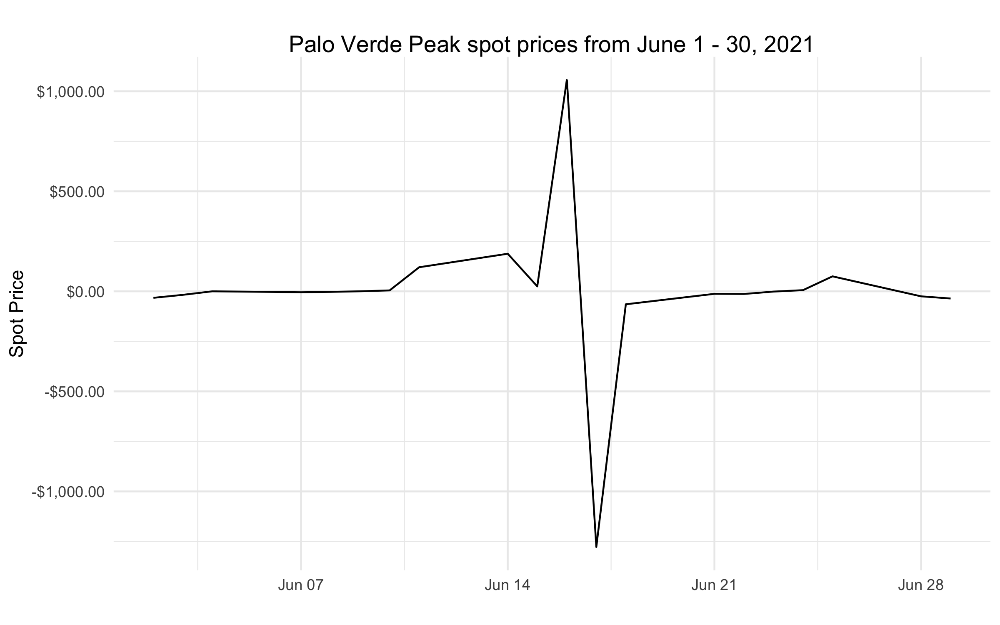

# Market Research for the Electric Power Industry
This report was created as background research when I applied for a Business Analyst internship with the Tucson Electric Power (TEP) company in 2024, who is a major supplier of electricity in Arizona. I wanted to understand how daily commodity prices affect TEP opeating margins, so I used R Studio to assess daily spot prices from 2014 - 2024, which I gathered data from the U.S. Energy Information Administration. Spot prices were favorable for TEP when there were drastic changes in energy consumption which was usually due to weather, and in some cases, a Power Power Agreement (PPA) can bring in significant short-term sales, such as the PPA that TEP signed with its affiliates for the Palo Verde Peak in June 2021, worth $84 million dollars (figure below illustrates this effect on spot prices). 

